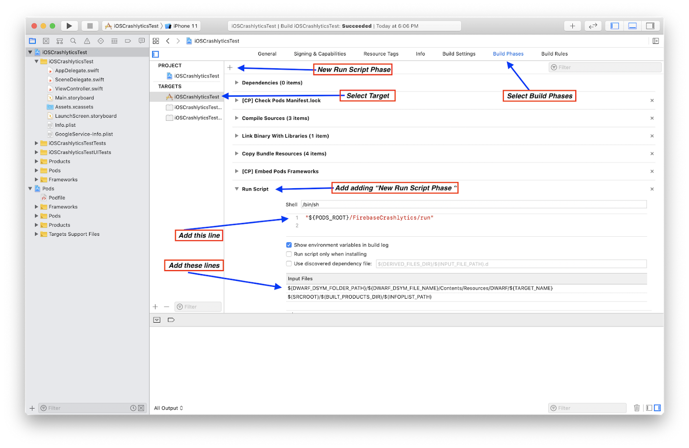

# FirebaseTest
Demo about Crashlytics and Analytics
     
# Definition
Crashlytics is a Firebase feature to support developers to diagnose 
and fix problems in an application. It's a lightweight, realtime crash
reporter that helps you track, prioritize, and fix stability issues
that erode your
app quality.
It logs usage data about your app and provide insights into the nature
of stability problems.
According to Crashlytics' Terms of Service, Crashlytics collects data such as:
   - Device state information
   - Unique device identifiers
   - Location data
   - Usage data
   - Email address (depending on how the developer implements Crashlytics)
This sort of data can constitute personal information. It reveals
information about individual people, and can, in theory, be linked to
them. It also reveals how individuals use your app.

Firebase Analytics is a tool which allows learning how users are engaging with
our application by tracking user and application data in just a few steps.
It collects usage and behavior data for your app. The SDK logs two primary types
of information:
   - Events: What is happening in your app, such as user actions, system events,
     or errors.
   - User properties: Attributes you define to describe segments of your user 
     base, such as language preference or geographic location. 

## Installation

- Setup for Both Firebase Crashlytics and Analytics: 
   
    1- Download “GoogleService-Info.plist” from Firebase and add it to xcode project. 
      
       
  
       
    
    2- Add Firebase/Crashlytics and Firebase/Analytics in project through pod.  
  
        
    
    3- import Firebase in AppDelegate and write FirebaseApp.configure().  
  
       
 
- Additional setup for Firebase Crashlytics: 
   
    * Add other required settings in xcode Project: 
   
        1- From the xcode project target click the Build Setting tab:  
  
           
    
        2- Then click in the Build Phases tab and add according the picture:         
           - In script field (located under the Shell label):  
             ``` "${PODS_ROOT}/FirebaseCrashlytics/run" ```  
           - In Input Files section:  
             ```
             ${DWARF_DSYM_FOLDER_PATH}/${DWARF_DSYM_FILE_NAME}/Contents/Resources/DWARF/${TARGET_NAME}
             ```  
             ```
             $(SRCROOT)/$(BUILT_PRODUCTS_DIR)/$(INFOPLIST_PATH)
             ```  
                
  
- Analytics automatically logs some events and user properties; you don't need to add any code to enable them.  

# Usage
* For Firebase Crashlytics:  
    - Make Crash test for example add this line to any action or in viewDidLoad of view controller  
       
    ```swift
    fatalError("Force Crash")
    ```   

   - After your app crashes, run it again from Xcode so that your app can send the crash
      report to Firebase.   
   - Go to the Crashlytics dashboard of the Firebase console to see your test crash.  
    
* Note:  
   - If you've refreshed the console and you're still not seeing the test crash after five
     minutes, try enabling debug logging (to help track down the problem) by:  
     1- Enable debug logging:  
           * In Xcode, select Product > Scheme > Edit scheme.    
           * Select Run from the left menu, then select the Arguments tab.    
           * In the Arguments Passed on Launch section, add:  
               
    ```swift
    -FIRDebugEnabled
    ```
           
     

    2- Force a test crash. The first section on this page describes how to do this.  

    3- Within your logs, search for a log message from Crashlytics that contains the
          following string, which verifies that your app is sending crashes to Firebase.  
           
     ```swift
     Completed report submission
     ```  
  
For Firebase Analytics:  
    - Add to any click on a specific element in your app:  
  
   ```swift
   Analytics.logEvent("Tap Here Button Event", // Event Name
                      parameters: ["FirstKey": "Hello 👋🏻 🤗"]) // Event Parameters [String : Any]? 
   ```  
  
   * Note:
        - To view this event in the Xcode debug console, enable Analytics debugging:  
            1- In Xcode, select Product > Scheme > Edit scheme...  
            2- Select Run from the left menu.  
            3- Select the Arguments tab.  
            4- In the Arguments Passed On Launch section, add:  
   ```swift
   -FIRAnalyticsDebugEnabled 
   ```  
     

# References
* [Firebase Docs For Crashlytics](https://firebase.google.com/docs/crashlytics/get-started?platform=ios#add-sdk)  
* [Firebase Docs For Analytics](https://firebase.google.com/docs/analytics/get-started?hl=en&authuser=0&platform=ios)  

* [Medium Example For Crashlytics](https://medium.com/@paulsoham/firebase-crashlytics-in-ios-swift-1d8c9aec63d0)  
* [Medium Example For Analytics](https://medium.com/exploring-android/exploring-firebase-on-android-ios-analytics-8484b61a21ba)  
     
    
## Author
Developed by:  
* [Ibrahim Ali](https://github.com/IbrahimAli2017)
* [Khalid Mahmoud](https://github.com/KhalidZayat)
* [Zeynab Ahmed](https://github.com/ZeynabAhmed)
